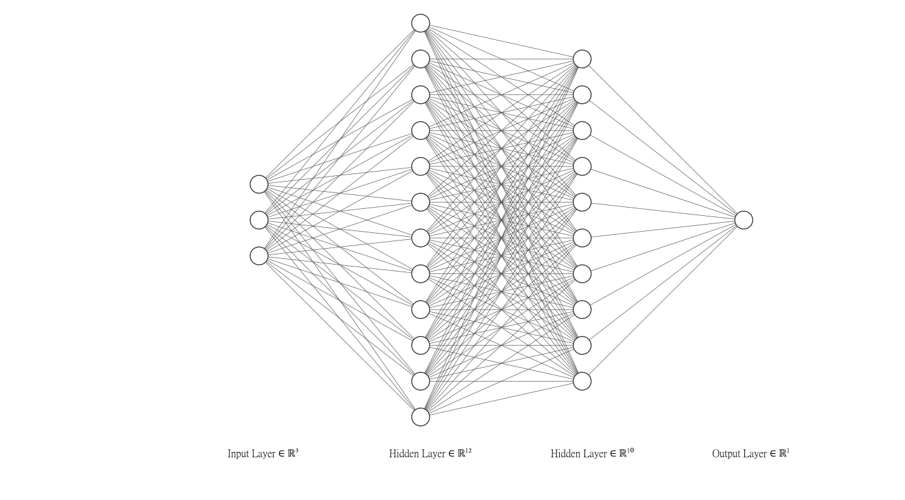
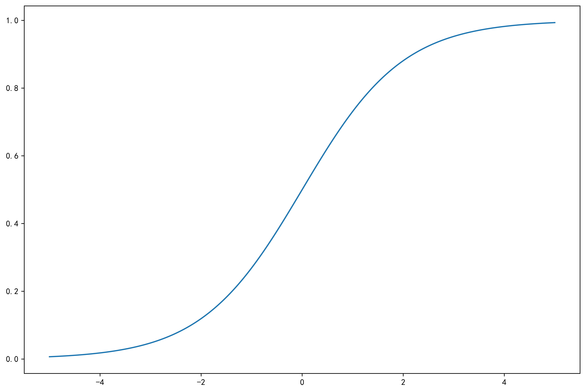
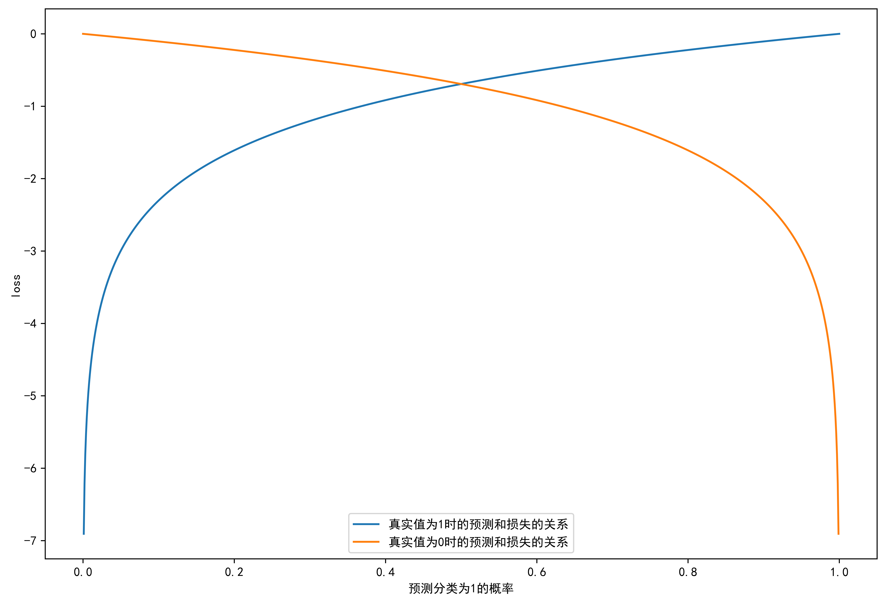

# BP Neural Network

BP神经网络作为一种强大的机器学习模型，广泛应用于各种预测和分类任务中。本文深入探讨了BP神经网络的关键组件，包括激活函数、损失函数、学习率调整策略及过拟合防止方法。特别地，分析了三种主要激活函数：Sigmoid、双曲正切函数（tanh）、和线性整流单元（ReLU）的特性及适用场景。此外，对比了交叉熵与均方误差这两种损失函数在处理不同类型问题时的效率和适应性。针对学习率，本文讨论了多种调整策略如固定学习率、动量法、随机梯度下降和Adam优化器，以及它们对模型性能的影响。为了解决过拟合问题，介绍了正则化（包括L2正则化）、数据增强、早停、bagging集成方法、dropout和批正则化等策略。整体而言，本文为深入理解BP神经网络的设计与优化提供了全面的分析和实用的指导。
 ## 激活函数
激活函数在神经网络中扮演着非常关键的角色，它定义了一个神经元的输出如何根据给定的输入和加权和来变化。激活函数的选择直接影响到神经网络处理非线性问题的能力。

神经元是神经网络的基本单位。在生物学中，神经元是大脑的细胞，负责处理和传递化学和电信号。在人工神经网络中，一个神经元接收来自其他神经元的输入信号，这些信号通过称为“权重”的参数加权，并且通常会加上一个“偏置”项。所有这些加权输入被累加，然后通过一个激活函数以产生输出。

+ 常见的激活函数Sigmoid函数、双曲正切函数、ReLU函数
+ 激活函数有以下特征
  + 非线性
  + 可微性
  + 单调性
  + $f(x)\approx x$
  + 输出值范围
  + 计算简单
  + 归一化
 ### Sigmoid函数
 $$
 \varphi(x) = \frac{1}{1 + e^{-x}}
 $$
+ Sigmoid函数优点在于输出范围有限,数据传播过程不容易发散，并且输出范围时(0,1)，可以在输出层表示概率值
+ Sigmoid函数的主要缺点时梯度下降非常明显，求两头过于平坦，容易出现梯度消失问题

### 双曲正切函数
$$
tanh(x) = \frac{e^x - x^{-x}}{x^{-x} + e^x}
$$
+ 双曲正切函数将数据映射到[-1,1]，解决了sigmoid函数值域不对称的问题。但梯度小时问题仍然存在。

### ReLU函数
$$
R(z) = max(0,z)
$$
+ ReLU函数是神经网络里最常用的激活函数，ReLU函数收敛速度比Sigmoid、Tanh更快，没有梯度饱和问题，只需要一个阈值就可以得到，不需要归一化输入来防止达到饱和

## 损失函数
### 交叉熵
+ 交叉熵（Cross-Entropy）是机器学习中常用的一种损失函数，特别适用于分类任务。在理论上，交叉熵衡量的是两个概率分布之间的差异，其中一个表示实际数据的分布，另一个表示预测分布。对于分类问题，它是一种衡量预测概率分布与真实标签分布之间差异的有效方法。
+ 可以用于目标位[0,1]区间的回归问题
$$
J(w) = \frac{1}{N}\sum_{n=1}^NH(p_n,q_n)=-\frac{1}{N}\sum_{n=1}^N[y_n\log\widehat{y}_n-(1-y_n)\log(1-\widehat{y}_n)]
$$
其中，$ y $ 是真实的标签，通常为0或1；$ \widehat{y} $ 是预测类别为1的概率。

+ **优点**
  1. **敏感性**：交叉熵对于模型预测概率与实际标签之间的小差异非常敏感。当预测概率偏离真实标签时，产生的损失迅速增加，这使得模型更快地学习正确的分类。
  2. **非对称性**：这种损失函数在处理非平衡数据集（某些类别的样本远多于其他类别）时非常有效，因为它通过概率直接对每个类的预测进行惩罚。

当真实值为1时，预测分类为1的概率大于0.5时的损失非常小，但预测概率小于0.5时损失会迅速扩大

### 均方误差
均方误差（Mean Squared Error，简称 MSE）是一种常用的损失函数，广泛应用于回归问题以及神经网络的训练中。MSE 衡量的是预测值与实际值之间差异的平方的平均值。数学表达式如下：

$$
MSE = \frac{1}{n}\sum_{i=1}^n(\widehat{y}_i-i_i)^2
$$
其中, $ \widehat{y}_i $ 是模型预测的第 $ i $ 个输出, $y_i $ 是实际的第 $ i $ 个输出, $ n $ 是样本总量

在BP神经网络中，MSE 通常用作损失函数，以指导网络训练过程中的权重调整。具体来说，在训练过程中，神经网络的目标是最小化 MSE，即减少模型预测输出与实际输出之间的平方误差总和。

1. **误差传递**：在神经网络的每一层，通过计算损失函数的梯度来确定每个权重对总误差的贡献。对于 MSE，可以相对简单地计算这些梯度，因为平方函数的导数（$2(\widehat{y}_i - y_i)$）形式简单，易于在各层之间传递和更新。
2. **权重更新**：利用梯度下降或其他优化算法，根据计算得到的梯度更新网络中的权重。权重的更新旨在逐步减少预测误差，最终使得网络的 MSE 达到尽可能小。
3. **模型性能**：MSE 提供了一个量化指标，表明模型在训练数据上的表现。训练过程中 MSE 的减小通常表示模型预测能力的提高。
   
MSE 的主要优点是它简单、直观且计算效率高，特别适用于输出为连续值的情况。然而，在某些情况下（如分类问题），其他损失函数（如交叉熵）可能更为适合。MSE 在处理极端异常值时也可能导致问题，因为它会对较大的误差赋予更高的惩罚权重，有时可能会导致模型过于关注这些异常样本。

## 学习率
+ 学习率控制每次更新参数的幅度，过高何过低的学习率都可能队模型带来不良影响，何时的学习率可以加快模型的训练速度
+ 常见学习率调整方法
  + 经验手动调整
  + 固定学习率
  + 动量法动态调整
  + 随机梯度下降
  + Adam自动调整

## 过拟合
+ 过拟合是指模型在训练集上预测效果好，测试集效果差
+ 防止过拟合的方法有
  + 正则化
  + 数据增强
  + 早停
  + bagging集成方法
  + dropout
  + 批正则化
  
## 正则化
正则化是机器学习和统计建模中用于减少模型过拟合、提高模型在新数据上的泛化能力的技术。过拟合发生时，模型复杂度过高，虽然在训练数据上表现良好，但在未见数据（测试数据）上的表现却不佳。正则化通过向模型的损失函数添加一个惩罚项来解决这个问题，这个惩罚项可以约束模型的权重，防止模型过于复杂。
+ 将惩罚项添加到损失函数
+ L2正则化的损失函数公式如下：
$$
J = \frac{1}{2n}\sum_{i=1}^n(\widehat{y}_i-y_i)^2+\lambda\sum_{j = 1}^mW_j^2
$$
+ 其中，常量 $ \lambda $ 是正则化强度,变量$W_j$代表某个连接的权重

## Dropout

Dropout 是一种在深度学习中常用的正则化技术，特别是在训练复杂的神经网络模型时。这种方法由 Nitish Srivastava 等人于 2014 年提出，旨在防止神经网络的过拟合。Dropout 的基本思想是在训练过程中随机“丢弃”（即暂时移除）网络中的一部分神经元，从而减少神经元之间复杂的协同适应现象。