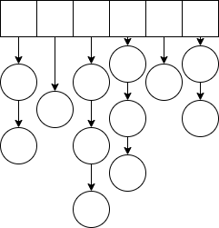
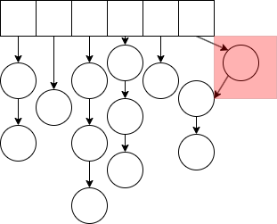

# hash table

将大范围数映射到小范围数

通常采用模运算
最好采用质数，这样冲突概率最小

可能存在冲突

## 拉链法

使用链表存储冲突数
一般冲突数很小

插入操作代码
```cpp
int h[N], e[N], ne[N], idx;

void insert(int x){
    int k = (x % N + N) % N;//防止出现负数
    e[idx] = x;
    ne[idx] = h[k];//头插
    h[k] = idx ++ ;
}
```



寻找是否存在x
```cpp
void insert(int x){
    if(!find(x)){
        int k = (x % N + N) % N;
        e[idx] = x;
        ne[idx] = h[k];
        h[k] = idx ++;
    }
}
```

## 字符串哈希

* 获取l到r字符串的哈希值
```cpp
int n, m; 
char st[N];
ULL h[N], p[N];

ULL get(int l, int r){
    return h[r] - h[l - 1] * p[r - l + 1];
}
int main(){
    
    cin >> n >> m ;
    cin >> st;
    p[0] = 1;
    for (int i = 1; i <=  n; i ++ ){
        p[i] = p[i - 1] * P;
        h[i] = h[i - 1] * P + st[i - 1];
    }
        while(m -- ){
        int l1, r1, l2, r2;
        cin >> l1 >> r1 >> l2 >> r2;
        if(get(l1, r1) == get(l2, r2)) puts("Yes");
        else puts("No");
    }
}
```