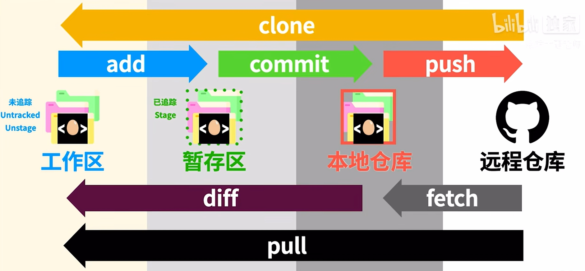
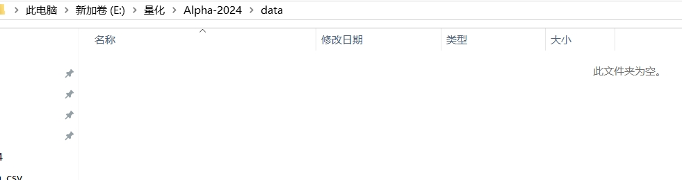

# git总体
## git总体工作框架


## git常用命令
输入用户名和邮箱，标记不同做出修改的用户
```
git config --global user.name "hdz"
git config --global user.email 2548538192@qq.com
```

进入项目的根目录，创建git项目
右键打开git base
```
git init
```
该命令可以初始化git项目


## git暂存区
git add命令可以将文件从工作区提交到暂存区


如果想要回退，有两种方式
* 情况一：比如我在工作区修改了一个文件，并提交到了暂存区，现在我想撤回暂存区，而且我工作区的修改也一并不想要了
  
```
git reset --hard HEAD
```
这个命令要慎用，我回退完工作区的data也没了



* 情况一：比如我在工作区修改了一个文件，并提交到了暂存区，提交了以后，现在我想撤回暂存区，但是我工作区的修改还想要
  
```
git reset HEAD
```
