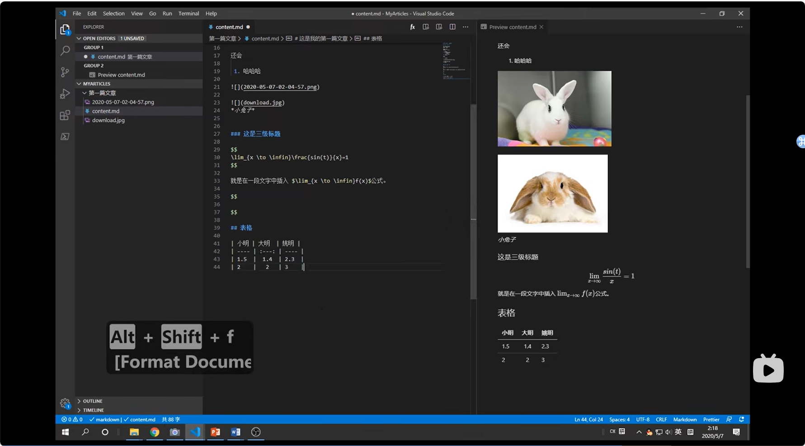

# markdown基础语法

## 表格
表格用竖线来创建

| 小陈  | 小明  | 小达  |
| :---: | :---: | :---: |
|  1.3  |  1.5  |   4   |
|   3   |   9   |   1   |

通过冒号控制对齐
*alt + shift + f* 可以格式化表格文本

## 斜体和加粗

*ctrl + i 可以快速斜体*  
**ctrl + b 可以快速黑体**

## 公式

$$
\lim_{x \to \infin}f(x)
$$
也可以在文本中插入公式$\lim_{x \to \infin}f(x)$，像这样

## 图片插入


## 列表
* 无序
  * 二级无序列表
* 无序列表

1. 有序
   1. 二级无序列表
   2. 像这样
   
##链接
添加链接到文字[哔哩哔哩](https://www.bilibili.com/?spm_id_from=333.788.0.0)

## code
```python
import csv
import os
import numpy as np
import pandas as pd
import pymysql
from pymysql import connect

class CsvToMysql(object):
    def __init__(self, hostname, port, user, passwd, db):
        self.dbname = db
        self.conn = connect(host=hostname, port=port, user=user, passwd=passwd, db=db)
        self.cursor = self.conn.cursor()
 
```

## 专注模式

ctrl + k + z进入
esc * 2退出
